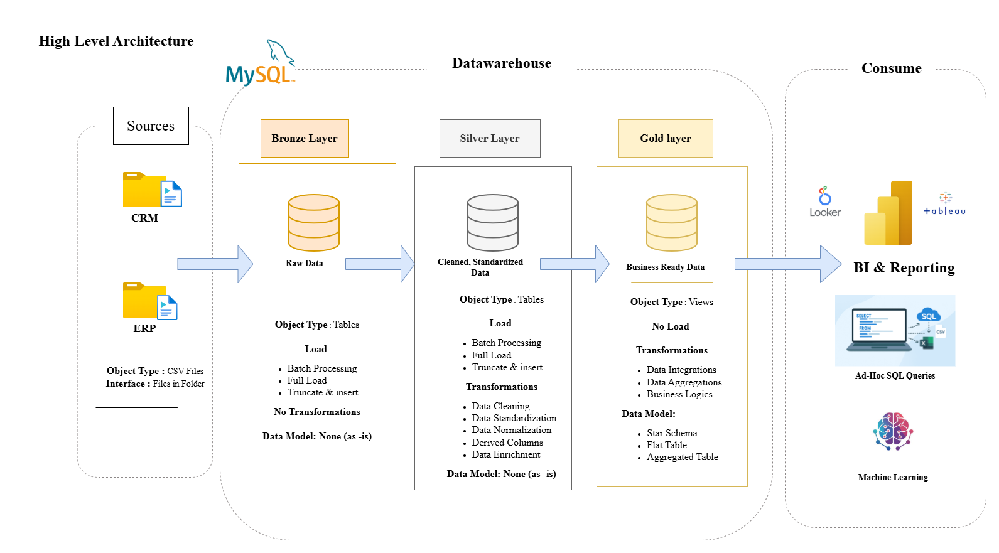

# Data Warehouse Project using MySQL

## Overview
This project demonstrates the end-to-end design and implementation of a Data Warehouse using MySQL.

The objective is to build a structured analytics platform that:
- ingests raw data from multiple sources (CRM, ERP)
- cleans and standardizes the data
- validates data quality
- transforms data into analytics-ready models
- supports reporting and business insights

The solution follows a layered (Medallion) architecture for better scalability, maintainability, and data reliability.

---

## Architecture
Bronze → Silver → Gold

---

## Layer Description

### Bronze (Raw Layer)

Stores raw source data exactly as received from CRM and ERP systems.

In this project, source CSV files are kept in the `datasets/` folder and imported directly into MySQL.  
Separate Bronze ingestion scripts were not required.

### Silver (Clean Layer)
- Data cleaning and standardization
- Remove nulls and duplicates
- Trim spaces and fix formats
- Apply business rules
- Perform data quality validations

### Gold (Analytics Layer)
- Business-ready tables for reporting
- Star schema design
- Dimension and fact tables
- Optimized for dashboards and analysis

---

## Data Model (Gold)
- dim_customers
- dim_products
- fact_sales

---

## Project Structure
- datasets
- docs
- tests
- scripts
- tests

### datasets
Sample CRM and ERP source CSV files used for loading raw data

### docs
- architecture diagrams
- data catalog
- naming conventions
- data flow and models

### scripts
SQL scripts organized by layer:
- bronze → raw loads
- silver → cleaning & transformations
- gold → analytical tables
- validations → data quality checks

### tests
Validation and quality check queries

---

## Tools & Technologies
- MySQL
- SQL
- CSV sample datasets
- draw.io (architecture & ER diagrams)
- Git & GitHub
- Data Warehousing concepts (Bronze–Silver–Gold architecture)

---

## Key Features
- Layered warehouse architecture
- ETL using SQL scripts
- Data quality validations
- Naming standards and documentation
- Star schema modeling
- Production-style project structure

---

## Learning Note

Learning Note:
This project was developed independently as a hands-on exercise after learning data engineering concepts from tutorials and implementing them in MySQL using my own approach.

---

## Author
Nagesh  
Senior Monitoring Analyst  

LinkedIn: https://www.linkedin.com/in/nagesh-n-960b88203

